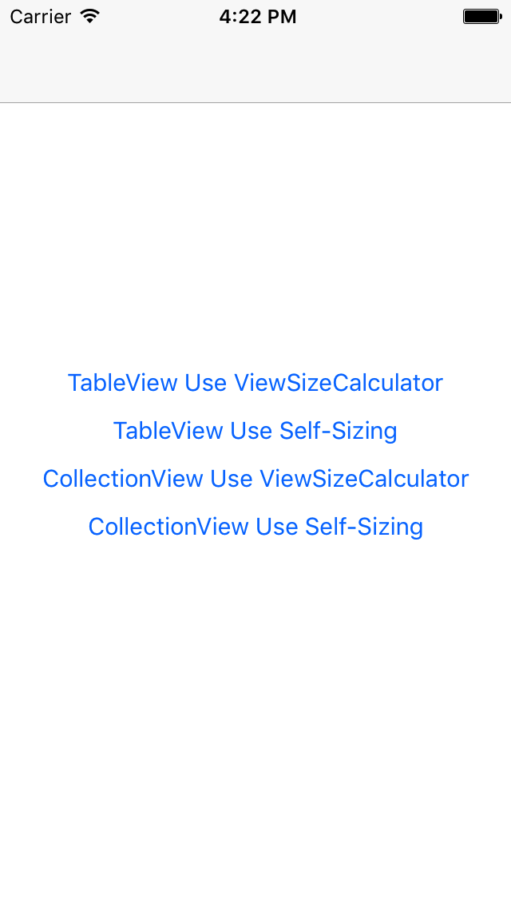
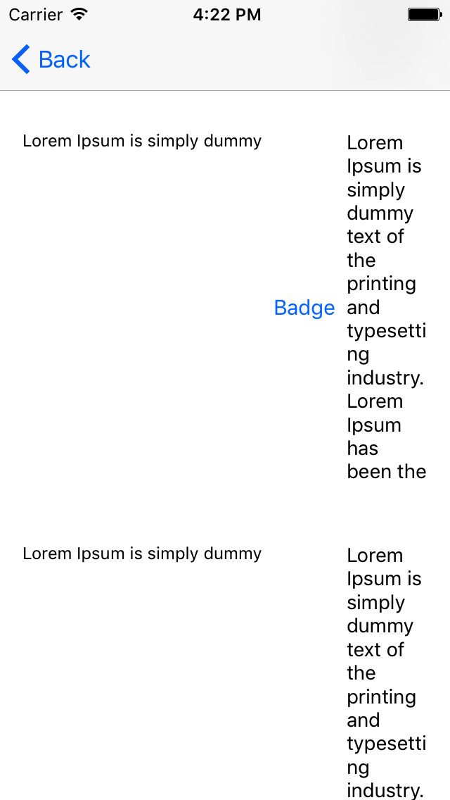

## Update (2020-11-27)

There is better way to do this.
https://stackoverflow.com/questions/44187881/uicollectionview-full-width-cells-allow-autolayout-dynamic-height

---

Example for calculating size of the cell that depends on itself content.

- Use muukii/ViewSizeCalculator on TableView
- Use UIKit Self-sizing on TableView
- Use muukii/ViewSizeCalculator on CollectionView
- Use UIKit Self-sizing on CollectionView
- Use [FlexLayout](https://github.com/layoutBox/FlexLayout) on CollectionView

